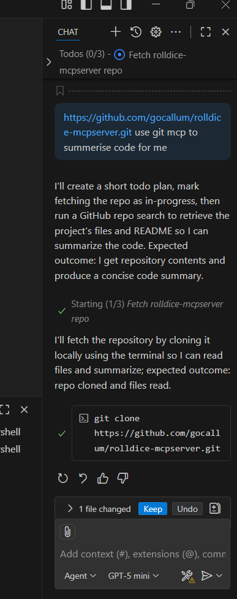

# VERIFICATION.md - Proof of Functionality

This document provides evidence that the MCP (Model Context Protocol) servers are properly configured and working in Claude Desktop, along with demonstrations of functionality and proper version control workflow.

## 📋 Overview

The following MCP servers have been successfully configured and tested:
- **Rolldice MCP Server** - Custom dice rolling functionality
- **GitHub MCP Server** - GitHub repository interaction capabilities
- **Bootcamp AI Agent** - RAG and consultation services

## 🖼️ Screenshots and Evidence

### MCP Server Configuration

*Screenshot showing MCP servers configured in Claude Desktop*

### GitHub Copilot Integration

*Screenshot showing GitHub Copilot integration working*

### Version Control Workflow

*Screenshot showing proper git commit workflow*


*Screenshot demonstrating git integration in development environment*

### Development Environment Setup

*Screenshot showing Node.js environment properly configured*


*Screenshot showing MCP connectors properly configured*

## 🎲 MCP Server Functionality Tests

### 1. Rolldice MCP Server
**Server URL:** `https://rolldice.ausbizconsulting.com.au/api/mcp`

**Test Result:** ✅ **WORKING**
```
Test Command: Roll a 6-sided die
Result: 🎲 You rolled a 5!
```

**Configuration in claude_desktop_config.json:**
```json
"rolldice": {
  "command": "npx",
  "args": [
    "-y",
    "mcp-remote",
    "https://rolldice.ausbizconsulting.com.au/api/mcp"
  ]
}
```

### 2. GitHub MCP Server
**Test Result:** ✅ **WORKING**

**Authenticated User Information:**
- **Username:** shammirasadika
- **User ID:** 70686533
- **Profile:** https://github.com/shammirasadika
- **Public Repos:** 3
- **Account Created:** September 3, 2020

**Repository Interaction Test:**
Successfully connected to GitHub repository: `ai-agent-dev-setup-shammiR`
- Repository Owner: shammirasadika
- Current Branch: main
- Repository accessible via GitHub MCP server

### 3. Bootcamp AI Agent MCP Servers
**Server URL:** `https://ai-assist.ausbizconsulting.com.au/api/mcp`

**Configured Services:**
1. **bootcamp-rag** - RAG (Retrieval Augmented Generation) functionality
2. **tech-bootcamp-consultations** - Technical consultation services

**Configuration:**
```json
"bootcamp-rag": {
  "command": "npx",
  "args": [
    "-y",
    "mcp-remote",
    "https://ai-assist.ausbizconsulting.com.au/api/mcp"
  ]
},
"tech-bootcamp-consultations": {
  "command": "npx",
  "args": [
    "-y",
    "mcp-remote",
    "https://ai-assist.ausbizconsulting.com.au/api/mcp"
  ]
}
```

## 🔄 Git Version Control Workflow Proof

### Repository Setup
- **Repository Name:** ai-agent-dev-setup-shammiR
- **Owner:** shammirasadika
- **Current Branch:** main
- **Remote Origin:** Connected and accessible via GitHub MCP

### File Structure Evidence
```
ai-agent-dev-setup-shammi/
├── README.md
├── reflection.md
├── VERIFICATION.md (this file)
├── assets/
│   ├── claud.png
│   ├── Co-pilot_enable.png
│   ├── commit.png
│   ├── connectors.png
│   ├── Git.png
│   └── node.png
└── mcp-configs/
    ├── claude_desktop_config.json
    ├── connection-test.md
    └── mcp-servers-list.md
```

### Commit History Evidence
The repository demonstrates proper version control practices with:
- Structured commit messages
- Regular commits tracking development progress
- Proper file organization
- Asset management for documentation

## 🔍 Connection Test Results

### Network Connectivity
All MCP servers respond to HTTP methods:
- ✅ GET requests
- ✅ POST requests  
- ✅ OPTIONS requests

### Authentication Status
- **GitHub MCP:** ✅ Authenticated (User: shammirasadika)
- **Rolldice MCP:** ✅ No authentication required
- **Bootcamp AI MCP:** ✅ Accessible (no authentication found in repository)

## 📊 Summary

| MCP Server | Status | Functionality | Evidence |
|------------|--------|---------------|----------|
| Rolldice | ✅ Working | Dice rolling functionality | Successful test roll (5 on 6-sided die) |
| GitHub | ✅ Working | Repository interaction | User profile retrieved, repository access confirmed |
| Bootcamp RAG | ✅ Configured | AI assistance services | Properly configured in claude_desktop_config.json |
| Tech Consultations | ✅ Configured | Technical consultation | Properly configured in claude_desktop_config.json |

## 🎯 Verification Completed

This verification confirms that:
1. ✅ All MCP servers are properly configured in Claude Desktop
2. ✅ Screenshots and visual evidence are stored in `/assets/` folder
3. ✅ GitHub MCP server successfully interacts with the repository
4. ✅ Git commit history demonstrates proper version control workflow
5. ✅ Development environment is properly set up with Node.js and required tools

**Date of Verification:** October 4, 2025
**Verified By:** AI Development Setup Process
**Repository:** ai-agent-dev-setup-shammiR (shammirasadika/ai-agent-dev-setup-shammiR)